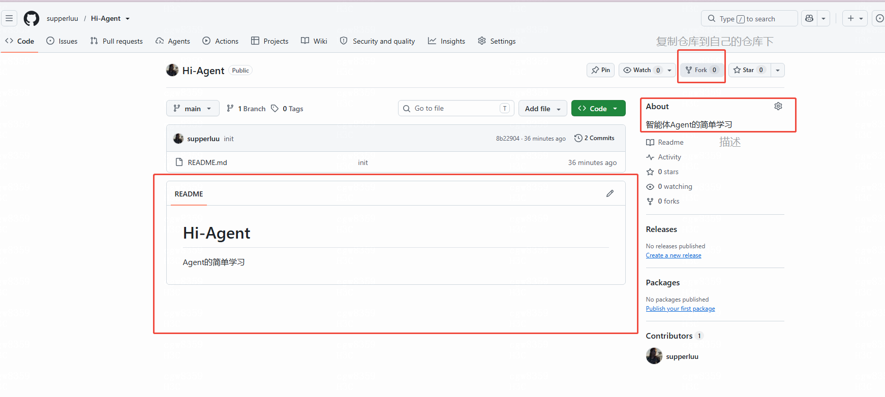
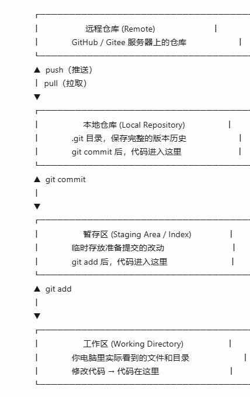
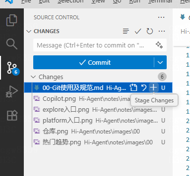
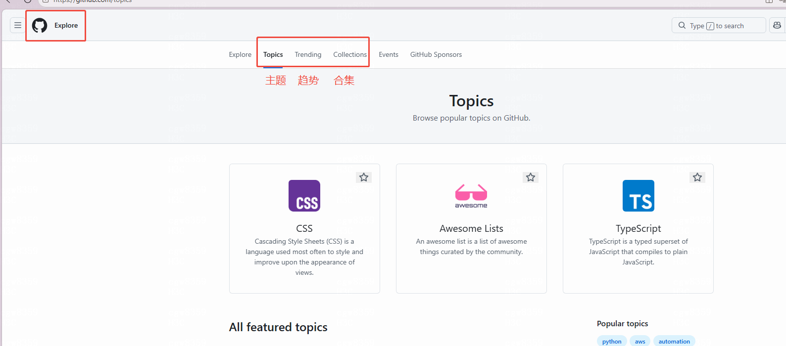
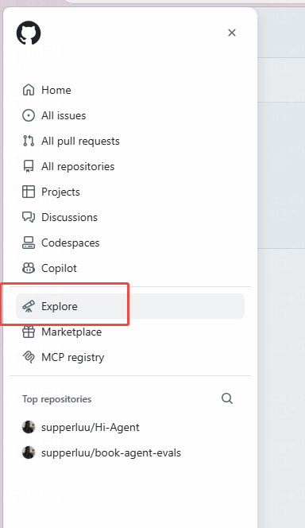
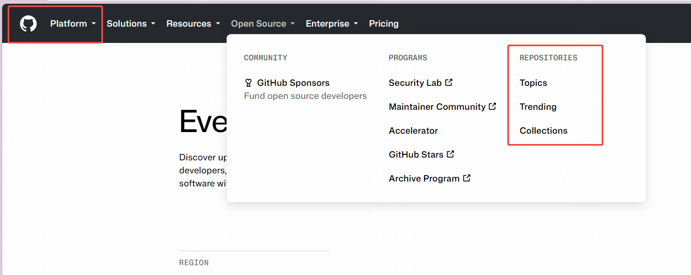
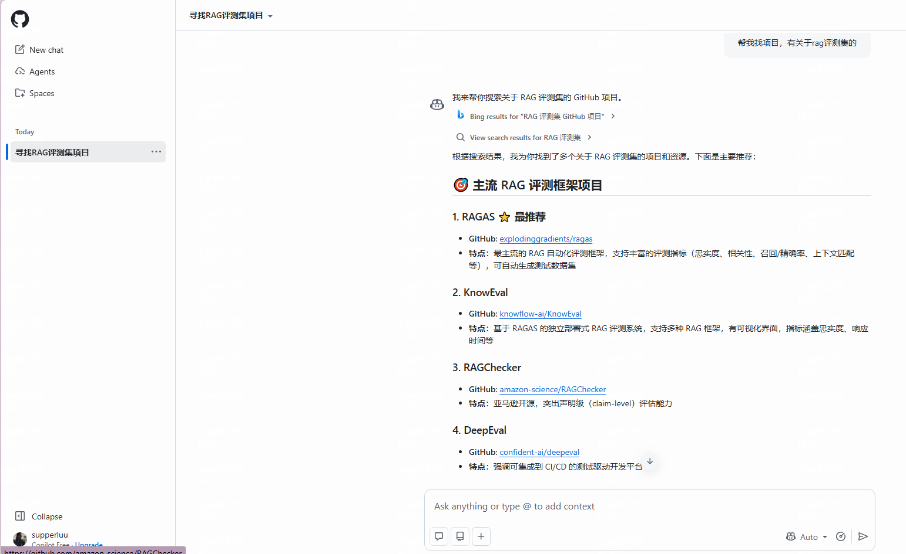

## Gitbub（全球）/Gitee（国内） 是什么
是代码托管与开源协作平台。
可以理解为，公开的存文件的地方。可以收藏、分享、讨论、协作。


### 一、基本操作


#### 1. 基本命令及仓库信息

| 术语 | 含义 |
|------|------|
| **Repository（仓库）** | 项目的根目录，包含代码、文档、版本历史 |
| **Branch（分支）** | 代码的并行线，main/master 是主分支，开发在 feature 分支 |
| **Commit（提交）** | 一次代码快照，附带提交信息（message） |
| **Push（推送）** | 将本地 Commit 上传到远程仓库 |
| **Pull（拉取）** | 将远程仓库的最新代码下载到本地 |
| **Pull Request（PR）** | 请求合并代码，是开源协作的核心流程 |
| **Fork** | 复制别人的仓库到自己的账号下，独立修改 |
| **Clone** | 将远程仓库下载到本地 |
| **Issue** | 项目的「问题/建议/讨论区」，可提 Bug、问问题 |
| **Star** | 收藏项目，表示「我觉得这个项目不错」|
| **Watch** | 关注项目，有更新会收到通知 |



#### 2. git的使用



```bash
### 完整提交流程（命令行版）

# 1. 查看当前状态（文件在哪个区域）
git status

# 2. 将工作区的改动添加到暂存区
git add 文件名          # 添加指定文件
git add .               # 添加所有改动（最常用）

# 3. 将暂存区的改动提交到本地仓库
git commit -m "feat: 新增用户登录功能"

# 4. 将本地仓库的提交推送到远程仓库
git push origin main

# 5. 拉取远程最新代码（协作前必做）
git pull origin main
```

##### 2.1 获取代码：

```cmd
$ git clone https://github.com/supperluu/Hi-Agent.git
Cloning into 'Hi-Agent'...
fatal: unable to access 'https://github.com/supperluu/Hi-Agent.git/': SSL peer c
ertificate or SSH remote key was not OK


$ git clone http://github.com/supperluu/Hi-Agent.git
Cloning into 'Hi-Agent'...
remote: Enumerating objects: 6, done.
remote: Counting objects: 100% (6/6), done.
remote: Compressing objects: 100% (2/2), done.
remote: Total 6 (delta 0), reused 0 (delta 0), pack-reused 0 (from 0)
Receiving objects: 100% (6/6), done.

```

##### 2.2 推送代码

在changes列表（工作区），对文件点击+ 号，文件就会到 Staged Changes 区域（暂存区），输入提交信息，依次点击Commit（本地仓库）,push（推送到远程）



### 二、获取项目
💡 快速判断项目是否值得深入：Star > 1000 + 最近 3 个月有更新 + README 完整 + Issues 有人回复 = 优质项目
#### 1. 闲逛模式
##### 1.1 手动搜索

输入'\\' 斜杠，快速唤起搜索框

中文搜不到换成英文试试
常用搜索模板
```text
# 找学习资源
awesome 技术名
roadmap 技术名
技术名 tutorial
技术名 example
技术名 boilerplate

# 找应用/工具
技术名 app
技术名 tool
技术名 cli
技术名 alternative          # 找替代品

# 找面试/求职资源
技术名 interview
技术名 resume
技术名 job
技术名 leetcode

# 找特定场景
技术名 starter
技术名 template
技术名 seed
技术名 scaffold
```

|目的|限定符 (Qualifier)|语法示例|说明|
|---|---|---|---|
|关键词定位|in:name</br>in:description</br>in:readme|微服务 in:name,description|指定在项目名、描述或README文件中搜索关键词，可组合使用。|
|按热度筛选|stars:</br>forks:|stars:>1000</br>stars:500..2000</br>微服务 stars:>1000 forks:>200|使用 >、< 或 .. 范围语法筛选Star或Fork数量。|
|按语言筛选|language:|language:python|精确查找特定编程语言的项目。|
|按时间筛选|created:</br>pushed:|created:>2024-01-01|查找在特定日期之后创建或更新过的项目。|
|排除结果|- (减号)|微服务 -demo|从搜索结果中排除包含特定关键词的项目。|
|Awesome 系列|awesome|awesome machine learning|在关键词前加上 awesome，寻找社区整理的同一主题**优质**资源合集。|
|roadmap 系列|roadmap|machine learning roadmap|在关键词后加上 roadmap，寻找社区整理的同一主题**优质**学习路线/发展路径。|
|文件查找器|t 键|在仓库内按 t 键|快速查找和浏览当前仓库内的所有文件。|


💡 举个例子
```bash
# 找近期活跃的 Python 机器学习项目
machine learning language:python stars:>500 pushed:>2024-06-01

# 找适合初学者的前端项目
frontend tutorial stars:100..1000 language:javascript

# 找某个公司的开源项目
org:google language:go stars:>1000
```

##### 1.2 热门搜索 

Topics(主题) == 话题标签
Trending(趋势)== 官网推荐榜,选择语言，编程语言及时间范围
Collections(集合) == 官网推荐榜

点击入口





##### 1.3 网站

|网站|特点|适合场景|
|---|---|---|
|https://hellogithub.com/|中文社区，月刊+热评，按语言分类|日常逛项目、中文用户友好|
|https://www.libhunt.com/|按技术领域和热门程度推荐，带用户评价和评分，支持替代方案对比|找特定技术栈的库，做技术选型|


#### 2. 工具辅助

##### 2.1 GitHub CLI
GitHub CLI (gh skill)：在GitHub命令行工具（CLI）2.90.0及以上版本中，新增了 gh skill 命令
``` cmd
# windows 安装命令
winget install --id GitHub.cli

# 查看版本 安装后需要重新开cmd窗口
gh --version
```

##### 2.2 GitHub Copilot
直接问助手
